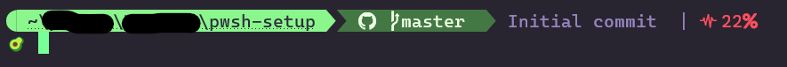

# AvoShell

Avocado powered PowerShell setup. Inspired by from [Hanselmans Ultimate PowerShell prompt](https://www.hanselman.com/blog/my-ultimate-powershell-prompt-with-oh-my-posh-and-the-windows-terminal?fbclid=IwAR0O6er7XgH5zY1oC6lCwK7ICjfqJvY8lTkvmwkAltPxeSFlyYEs23N3Y9E).



## Features

* Open explorer on ctrl + click on path
* Displays git repo status, including changed and stashed files
* Displays latest git commit
* Displays battery if low 
* Displays RAM if high
* Predictive autocomplete

## Install PowerShell

To get started install the .NET Core powered PowerShell from the [Microsoft Store](https://apps.microsoft.com/store/detail/powershell/9MZ1SNWT0N5D?hl=en-us&gl=us).

## Install and setup theme

When you have PowerShell installed, get Oh My Posh. This can be done easily by following their guide at [Oh My Posh Installation](https://ohmyposh.dev/docs/installation/windows). Use it to: 
* Install Oh My Posh
* Install NerdFont (Includes icons needed)
* Configure your terminal to use font

To use the setup in this repo, add [theme.omp.json](./theme.omp.json) to the location pointed to by the environment variable POSH_THEMES_PATH (default path is C:\Users\[user]\AppData\Local\Programs\oh-my-posh\themes). Add the following line to your PowerShell profile (open with VS Code: code $PROFILE).

```
oh-my-posh --init --shell pwsh --config "$env:POSH_THEMES_PATH\theme.omp.json" | Invoke-Expression
```

To edit the theme in VS Code, run the following line in your terminal.

```
code "$env:POSH_THEMES_PATH\theme.omp.json"
```

## Install and setup predictive autocomplete

To install autocomplete, run the following command in PowerShell

```
Install-Module PSReadLine -AllowPrerelease -Force
```

Then add the following lines to your PowerShell profile

```
Import-Module PSReadLine
Set-PSReadLineOption -PredictionSource History
Set-PSReadLineOption -PredictionViewStyle ListView
Set-PSReadLineOption -EditMode Windows
```

## Unleash the power of Kanye [Ye] West

Not interested in seeing the latest git commit? Then you might be interested in getting quotes from Kanye West. Replace the command in the git log command segment with the following line to get a new Kanye West quote for each command.

```
$response = Invoke-RestMethod -Uri \"https://api.kanye.rest/\"; $response.quote
```